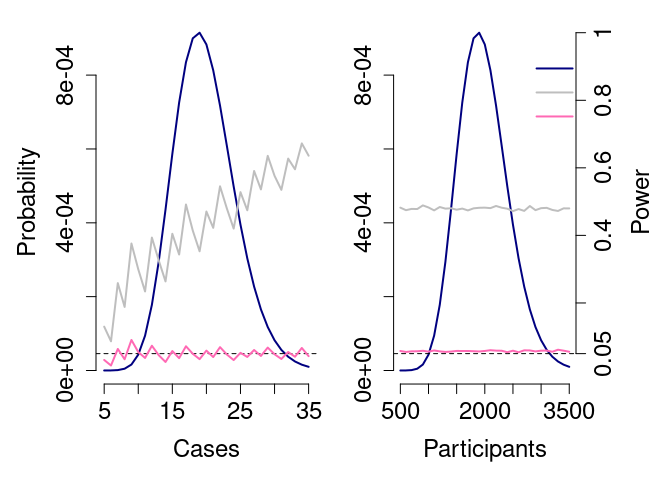
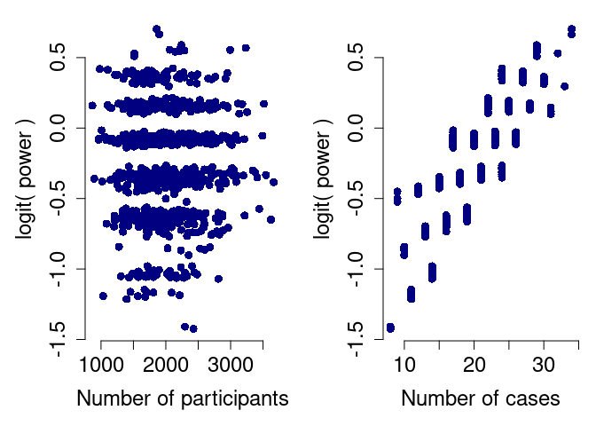

Code to accompany
[manuscript](https://github.com/robj411/ADAGIO/blob/master/Adaptive_Vaccine_Trials.pdf)
“Quantifying efficiency gains of innovative designs of two-arm vaccine
trials for COVID-19 using an epidemic simulation model”.

# Trial size calculation

The power of the final analysis to detect an effect depends on the
number of participants, the number of cases, and the vaccine efficacy.
If the power of a statistical test is defined as its probability to
reject the null hypothesis where there is an effect, and we write
power=p(N,c) where N is the number of participants and c the number of
cases, then the expected power for a trial with N participants is the
expectation of p(N,c) over c given N, and the expected power for a trial
with c cases is the expectation of p(N,c) over N given c. 

We compute the power p(N,c) for N=2,000 participants, a vaccine efficacy
of 0.5 and case numbers c ranging from 5 to 35, assuming fixed and equal
randomisation and binomially distributed outcomes. Likewise, we compute
the powers of trials with the same efficacy and incidence but a fixed
number of cases, c=20.

Where the number of participants is fixed, power increases with the
number of cases. Where the number of cases is fixed, the power does not
increase with increasing participants. That is, p(N,c) is more sensitive
to c than N (in this case, where incidence is low). Therefore, when
designing a trial targeting a particular power, the number of cases
observed should define the trial size, rather than the number of
participants enrolled. A trial with size determined by the number of
cases will more likely terminate efficiently and with the desired power.
A trial with size determined by the number of participants risks (a)
terminating with too little power, and (b) continuing too long, after
sufficient information has been accrued, thus delaying the final
analysis and potential rollout of the product.

# Information

Put another way, the number of cases contains more information about the
power than does the number of participants. This can be seen in scatter
plots of relationships between randomly sampled case numbers and
randomly sampled participants numbers and the power, respectively:

These relationships, in turn, can be summarised via the mutual
information (MI, from information theory) or value of information (VOI,
from decision theory):

    ##               VOI   MI
    ## Participants 0.02 0.04
    ## Cases        0.30 1.10
